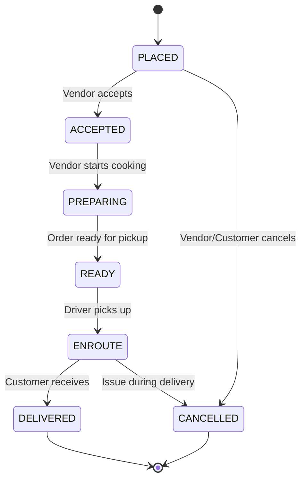

# QuickBite - System Architecture

## 1. System Objective

QuickBite is a food delivery marketplace that connects three core user groups:
- **Customers**: Browse vendors, place orders, track delivery
- **Vendors**: Manage menus, receive and fulfill orders
- **Drivers**: Accept delivery requests, navigate to destinations

The platform orchestrates the complete order lifecycle from placement through delivery, handling payments, notifications, and real-time status updates.

## 2. Architecture Decision: Modular Monolith

### Why Modular Monolith?

For MVP, we choose a **modular monolith** over microservices:

**Advantages:**
- Single deployable artifact simplifies CI/CD
- Easier debugging and development workflow
- ACID transactions across modules (orders + payments)
- Lower operational complexity (no service mesh, distributed tracing setup)
- Faster iteration speed for product-market fit

**Trade-offs:**
- Scaling requires scaling entire app (acceptable for MVP <10K orders/day)
- Module boundaries must be enforced via package structure
- Future extraction to microservices possible if domains stabilize

### Module Boundaries

```
com.quickbite/
  ├─ auth/          # JWT generation/validation, login, registration
  ├─ users/         # User profiles, roles, addresses
  ├─ vendors/       # Vendor registration, profile, business hours
  ├─ menu/          # Menu items, pricing, availability
  ├─ orders/        # Order creation, lifecycle, status transitions
  ├─ payments/      # Payment intent, provider integration (Stripe)
  ├─ drivers/       # Driver profiles, assignment, location tracking
  ├─ admin/         # Analytics, moderation, configuration
  └─ common/        # Shared DTOs, exceptions, utils
```

## 3. Runtime Components

| Component | Purpose | MVP Requirement |
|-----------|---------|----------------|
| **PostgreSQL 13+** | Primary data store with JSONB support | Required |
| **Redis 6+** | Session caching, rate limiting, real-time data | Required |
| **RabbitMQ / AWS SQS** | Async order notifications, email queue | Optional (Day 4+) |
| **MinIO / S3** | Vendor logos, menu images, receipts | Required (Day 5+) |
| **Prometheus + Grafana** | Metrics collection and dashboards | Optional |
| **ELK / CloudWatch** | Log aggregation and search | Optional |

### Sample Docker Compose

```yaml
services:
  postgres:
    image: postgres:13
    environment:
      POSTGRES_DB: quickbite
      POSTGRES_USER: dbuser
      POSTGRES_PASSWORD: dbpass
    ports:
      - "5432:5432"
  
  redis:
    image: redis:6-alpine
    ports:
      - "6379:6379"
```

## 4. API Boundaries

### Core REST Endpoints

```
# Auth
POST   /api/auth/register
POST   /api/auth/login
POST   /api/auth/refresh

# Vendors
GET    /api/vendors              # Search/list with filters
GET    /api/vendors/{id}
POST   /api/vendors              # Vendor registration (auth)
PUT    /api/vendors/{id}

# Menu
GET    /api/vendors/{id}/menu
POST   /api/vendors/{id}/menu    # Add menu item
PUT    /api/menu/{itemId}

# Orders
POST   /api/orders               # Create order
GET    /api/orders/{id}
GET    /api/orders/my-orders     # Customer view
PATCH  /api/orders/{id}/status   # Vendor/Driver updates

# Payments
POST   /api/payments/intent      # Create Stripe PaymentIntent
POST   /api/payments/confirm

# Drivers
GET    /api/drivers/available-orders
POST   /api/drivers/accept/{orderId}
PUT    /api/drivers/location     # GPS tracking
```

## 5. Order Lifecycle



### State Transition Rules

- `PLACED`: Customer completes payment, order created
- `ACCEPTED`: Vendor confirms (< 5 min SLA)
- `PREPARING`: Vendor marks as cooking
- `READY`: Vendor signals pickup
- `ENROUTE`: Driver scans/accepts, starts navigation
- `DELIVERED`: Driver confirms delivery (photo/OTP)
- `CANCELLED`: Any party can cancel with reason

## 6. Deployment Strategy

### Development
- **Local**: Docker Compose with hot reload
- **Command**: `docker-compose up -d && mvn spring-boot:run`

### Production (MVP)
Choose one:
- **AWS ECS/Fargate**: Containerized deployment with RDS + ElastiCache
- **Render/Railway**: Simplified PaaS for startups
- **DigitalOcean App Platform**: Mid-tier option

### Infrastructure Checklist
- [ ] DB backups automated (daily)
- [ ] SSL/TLS termination at load balancer
- [ ] Environment variables via secrets manager
- [ ] Health checks: `GET /actuator/health`

## 7. Security Considerations

- **Authentication**: JWT (access 15m, refresh 7d)
- **Authorization**: Role-based (CUSTOMER, VENDOR, DRIVER, ADMIN)
- **Input Validation**: Bean Validation (JSR-380)
- **SQL Injection**: Prevented by JPA/Hibernate
- **Rate Limiting**: Redis-based per IP/user

## 8. Next Steps (Day 2)

- [ ] Complete database schema design (all tables)
- [ ] Create JPA entities with relationships
- [ ] Implement Flyway migrations V1-V5
- [ ] Write repository interfaces (Spring Data JPA)
- [ ] Add global exception handler
- [ ] Configure Spring Security with JWT filter
- [ ] Implement UserDetailsService
- [ ] Add Swagger/OpenAPI documentation

---

**Document Version**: 1.0  
**Last Updated**: 2026-02-18  
**Owner**: Engineering Team
